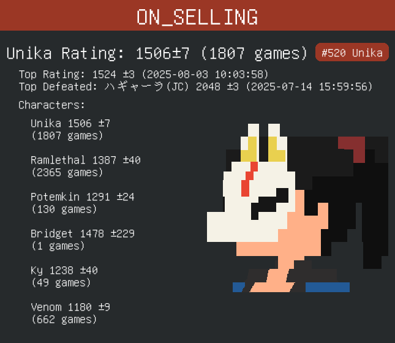

# gg_namecard_gen


Generate a name card using data from puddle.farm.


(namecard of bilibili@ON_SELLING)[not me]
# Quick try!
```bash
    https://github.com/meipeter/gg_namecard_gen.git
    cd gg_namecard_gen
    cargo run 240608152606560723
```
You can also install it by:
```bash
   cargo install gg_namecard_gen
   gg_namecard_gen 240608152606560723
```
## Example

```rust

//To known how to work with puddle.farm API, you can check out /src/main

use gg_namecard_gen::generate_gg_namecard;
use puddle_farm_api_client_openapi_client::models::PlayerResponse;
use anyhow::Result;

fn main() -> Result<()> {
    let p: PlayerResponse = serde_json::from_str(include_str!("../240608152606560723.json"))?;
    let a = image::open("./avtar.png")?.into_rgba8();
    let img = generate_gg_namecard(p, a)?;
    img.save("postcard.png")?;
    Ok(())
}
```
